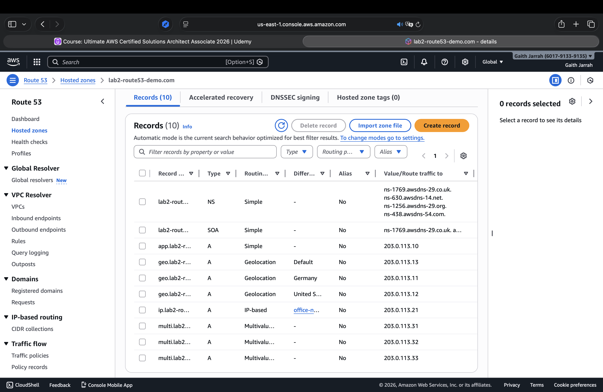

# AWS Highly Available Web Architecture

[]
## About this project
This project is a hands-on AWS lab that focuses on designing a highly available and scalable web architecture.
The goal was to practice real AWS infrastructure concepts such as networking, load balancing, and auto scaling,
rather than building application code.

The architecture is designed to follow common AWS best practices and production-style patterns.

---

## Architecture summary
- A custom VPC deployed across two Availability Zones
- Public subnets hosting an Application Load Balancer
- Private subnets hosting EC2 instances
- An Auto Scaling Group distributing instances across AZs
- NAT Gateways providing outbound internet access for private instances

---

## AWS services used
- Amazon VPC
- Public and Private Subnets
- Internet Gateway
- NAT Gateway
- Route Tables
- Security Groups
- Application Load Balancer (ALB)
- Target Group
- Auto Scaling Group (ASG)
- Amazon EC2

---

## Traffic flow
Inbound traffic:
```
Internet → Application Load Balancer → EC2 instances (private subnets)
```

Outbound traffic:
```
EC2 instances (private subnets) → NAT Gateway → Internet
```

Direct inbound access to EC2 instances is not allowed.

---

## Design choices
- EC2 instances are placed in private subnets to reduce the attack surface
- The Application Load Balancer handles incoming traffic and health checks
- Auto Scaling Group provides fault tolerance and automatic instance replacement
- Instances are spread across multiple Availability Zones for high availability
- NAT Gateways allow instances to access the internet without public IP addresses

---

## High availability
- The Auto Scaling Group maintains instances across two Availability Zones
- If an instance becomes unhealthy, it is automatically replaced
- Traffic is routed only to healthy instances by the load balancer

---

## What I learned
- How to design a highly available AWS architecture
- How public and private subnets are used in real environments
- How Auto Scaling Groups behave under scaling events
- The difference between EC2 health checks and ALB health checks
- Why proper cleanup is important to avoid unexpected cloud costs

---


## Lab 2 – Amazon Route 53 Routing Policies

### Description
In this lab, I worked hands-on with Amazon Route 53 to understand how DNS routing
policies work in real AWS environments.  
The goal was to learn how traffic can be routed based on different conditions such as
user location, client IP address, and availability.

This lab focuses only on DNS and routing concepts and was implemented using the
AWS Management Console.

---

### What was implemented

#### 1. Simple Routing
- Created a basic A record that always returns the same IP address.
- Used to demonstrate default DNS behavior.

#### 2. Geolocation Routing
- Implemented routing based on the user’s geographic location.
- Records were created for:
  - Germany
  - United States
  - Default (fallback for other locations)

#### 3. IP-based Routing
- Implemented routing based on the client’s source IP address.
- CIDR collections were created and used to map specific IP ranges to specific DNS responses.

#### 4. Multi-Value Answer Routing
- Created multiple A records for the same DNS name.
- Demonstrates DNS-level load distribution and basic availability concepts.

---

### Screenshot – Route 53 Records
The screenshot below shows all Route 53 records created during this lab.
It highlights the use of multiple routing policies within the same hosted zone,
including Simple, Geolocation, IP-based, and Multi-Value routing.



---

### AWS Services Used
- Amazon Route 53
- Hosted Zones
- DNS Routing Policies
- CIDR Collections

---

### Notes
- All IP addresses used are documentation/test IPs.
- No applications or compute services were deployed.
- Cost impact is minimal and limited to Route 53 DNS usage.

---

### Outcome
After completing this lab, I am comfortable with:
- Choosing the correct Route 53 routing policy for different scenarios
- Explaining DNS routing behavior in AWS
- Designing basic traffic-routing strategies for global users
