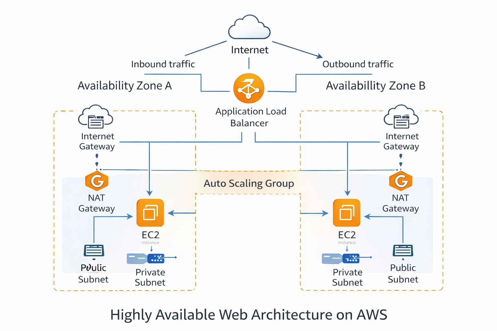

# AWS Highly Available Web Architecture

[](https://raw.githubusercontent.com/USERNAME/aws-ha-web-architecture/main/architecture.png)
## About this project
This project is a hands-on AWS lab that focuses on designing a highly available and scalable web architecture.
The goal was to practice real AWS infrastructure concepts such as networking, load balancing, and auto scaling,
rather than building application code.

The architecture is designed to follow common AWS best practices and production-style patterns.

---

## Architecture summary
- A custom VPC deployed across two Availability Zones
- Public subnets hosting an Application Load Balancer
- Private subnets hosting EC2 instances
- An Auto Scaling Group distributing instances across AZs
- NAT Gateways providing outbound internet access for private instances

---

## AWS services used
- Amazon VPC
- Public and Private Subnets
- Internet Gateway
- NAT Gateway
- Route Tables
- Security Groups
- Application Load Balancer (ALB)
- Target Group
- Auto Scaling Group (ASG)
- Amazon EC2

---

## Traffic flow
Inbound traffic:
```
Internet → Application Load Balancer → EC2 instances (private subnets)
```

Outbound traffic:
```
EC2 instances (private subnets) → NAT Gateway → Internet
```

Direct inbound access to EC2 instances is not allowed.

---

## Design choices
- EC2 instances are placed in private subnets to reduce the attack surface
- The Application Load Balancer handles incoming traffic and health checks
- Auto Scaling Group provides fault tolerance and automatic instance replacement
- Instances are spread across multiple Availability Zones for high availability
- NAT Gateways allow instances to access the internet without public IP addresses

---

## High availability
- The Auto Scaling Group maintains instances across two Availability Zones
- If an instance becomes unhealthy, it is automatically replaced
- Traffic is routed only to healthy instances by the load balancer

---

## What I learned
- How to design a highly available AWS architecture
- How public and private subnets are used in real environments
- How Auto Scaling Groups behave under scaling events
- The difference between EC2 health checks and ALB health checks
- Why proper cleanup is important to avoid unexpected cloud costs

---

## Cleanup
All AWS resources created during this lab were deleted after completion.
No services were left running, and no ongoing costs were incurred.
